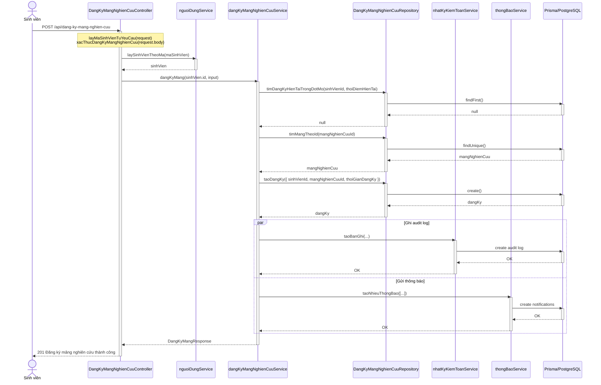
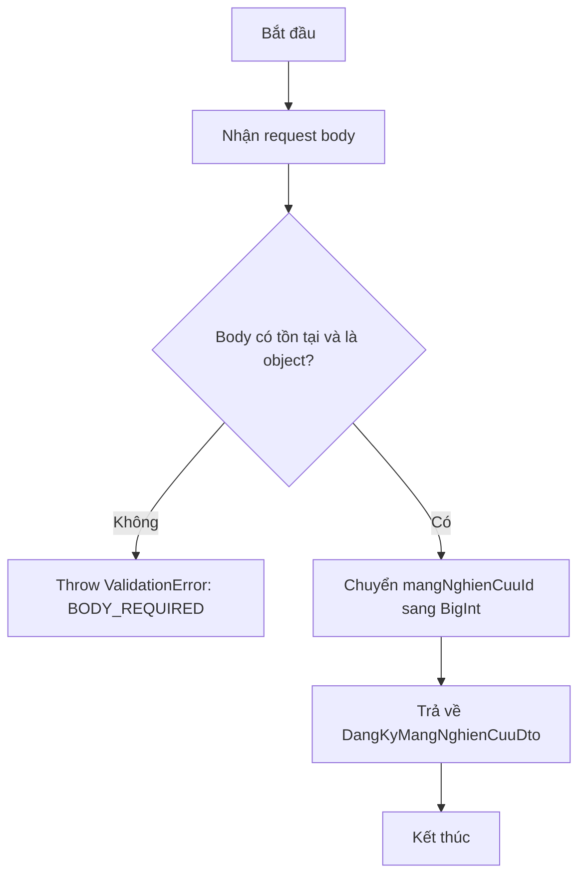
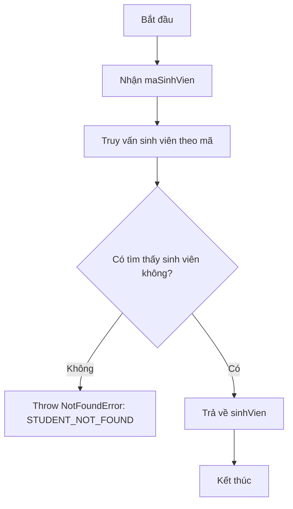
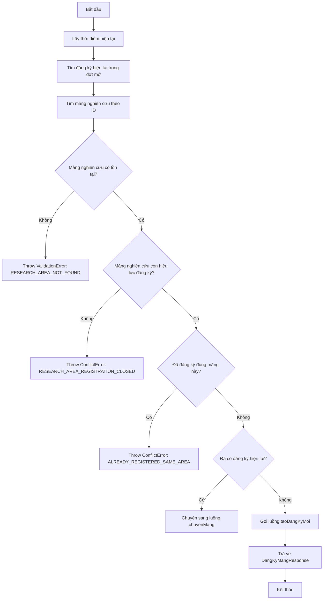
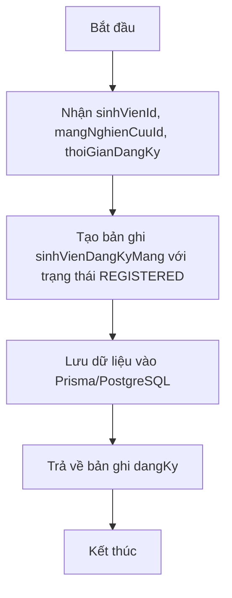
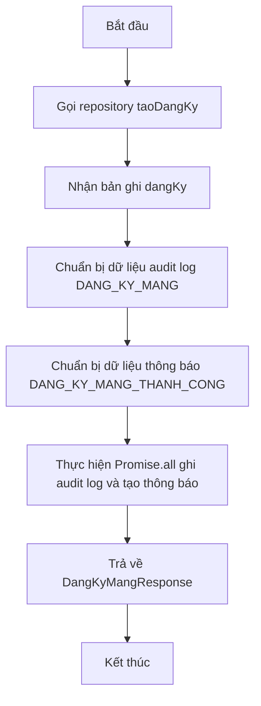

# 4.3.1. Chức năng "Đăng ký mảng nghiên cứu"

- **Input:** maSinhVien, mangNghienCuuId
- **Output:** Thông báo "Đăng ký mảng nghiên cứu thành công" hoặc thông báo lỗi tương ứng
- **Process:**
  + Vào màn hình "Đăng ký mảng nghiên cứu".
  + Sinh viên chọn một mảng nghiên cứu và nhấn nút "Đăng ký".
  + Hệ thống lấy mã sinh viên từ request, kiểm tra dữ liệu đầu vào và đối chiếu thông tin sinh viên trong hệ thống.
  + Hệ thống kiểm tra sinh viên đã có đăng ký mảng trong đợt hiện tại hay chưa, đồng thời kiểm tra mảng nghiên cứu có tồn tại và còn hiệu lực đăng ký hay không.
  + Nếu sinh viên chưa có đăng ký trong đợt hiện tại và mảng nghiên cứu hợp lệ, hệ thống tạo bản ghi đăng ký mới, ghi nhật ký kiểm toán và tạo thông báo cho sinh viên.
    - Nếu thiếu dữ liệu bắt buộc, hệ thống hiển thị thông báo "Thiếu dữ liệu đăng ký mảng".
    - Nếu không tìm thấy sinh viên, hệ thống hiển thị thông báo "Không tìm thấy sinh viên".
    - Nếu mảng nghiên cứu không tồn tại, hệ thống hiển thị thông báo "Mảng nghiên cứu không tồn tại".
    - Nếu đợt đăng ký không còn hiệu lực, hệ thống hiển thị thông báo "Đợt đăng ký mảng nghiên cứu không còn hiệu lực".
    - Nếu sinh viên đã đăng ký đúng mảng này trong đợt hiện tại, hệ thống hiển thị thông báo "Sinh viên đã đăng ký mảng nghiên cứu này trong đợt hiện tại".

## 4.3.1.1. Sơ đồ tuần tự

## 4.3.1.2. Các unit cần cho chức năng "Đăng ký mảng nghiên cứu"

- **Dữ liệu**

| STT | Tên | Kiểu dữ liệu | Mô tả |
|-----|-----|--------------|-------|
| 1 | maSinhVien | string | Mã sinh viên gửi trong header `x-ma-sinh-vien` |
| 2 | mangNghienCuuId | bigint | Mã mảng nghiên cứu được chọn |
| 3 | sinhVienId | bigint | Định danh sinh viên trong hệ thống |
| 4 | thoiDiemHienTai | Date | Thời điểm thực hiện đăng ký |
| 5 | dangKyHienTai | DangKyHienTaiResponse \| null | Đăng ký hiện tại của sinh viên trong đợt mở |
| 6 | mangNghienCuu | MangNghienCuu | Thông tin mảng nghiên cứu được chọn |
| 7 | dangKy | DangKyMangResponse | Kết quả đăng ký mảng mới |

- **Unit cần thiết**

| STT | Class | Method | Input | Output |
|-----|-------|--------|-------|--------|
| 1 | DangKyMangNghienCuuController | dangKyMang(request, response) | request, response | 201: Đăng ký mảng nghiên cứu thành công |
| 2 | nguoiDungService | laySinhVienTheoMa(maSinhVien) | maSinhVien | sinhVien |
| 3 | dangKyMangNghienCuuService | dangKyMang(sinhVienId, input) | sinhVienId, input | DangKyMangResponse |
| 4 | DangKyMangNghienCuuRepository | timDangKyHienTaiTrongDotMo(sinhVienId, thoiDiemHienTai) | sinhVienId, thoiDiemHienTai | dangKyHienTai \| null |
| 5 | DangKyMangNghienCuuRepository | timMangTheoId(mangNghienCuuId) | mangNghienCuuId | mangNghienCuu |
| 6 | DangKyMangNghienCuuRepository | taoDangKy({ sinhVienId, mangNghienCuuId, thoiGianDangKy }) | sinhVienId, mangNghienCuuId, thoiGianDangKy | dangKy |
| 7 | nhatKyKiemToanService | taoBanGhi(input) | input | Ghi audit log thành công |
| 8 | thongBaoService | taoNhieuThongBao(danhSachThongBao) | danhSachThongBao | Tạo thông báo thành công |

- `DangKyMangNghienCuuController::dangKyMang(request, response)`
- `nguoiDungService::laySinhVienTheoMa(maSinhVien)`
- `dangKyMangNghienCuuService::dangKyMang(sinhVienId, input)`
- `DangKyMangNghienCuuRepository::timDangKyHienTaiTrongDotMo(sinhVienId, thoiDiemHienTai)`
- `DangKyMangNghienCuuRepository::timMangTheoId(mangNghienCuuId)`
- `DangKyMangNghienCuuRepository::taoDangKy({ sinhVienId, mangNghienCuuId, thoiGianDangKy })`
- `nhatKyKiemToanService::taoBanGhi(input)`
- `thongBaoService::taoNhieuThongBao(danhSachThongBao)`

## 4.3.1.3. Activity cho `xacThucDangKyMangNghienCuu()`

## 4.3.1.4. Activity cho `nguoiDungService::laySinhVienTheoMa(maSinhVien)`

## 4.3.1.5. Activity cho `dangKyMangNghienCuuService::dangKyMang(sinhVienId, input)`

## 4.3.1.6. Activity cho `DangKyMangNghienCuuRepository::taoDangKy(...)`

## 4.3.1.7. Activity cho `dangKyMangNghienCuuService::taoDangKyMoi(...)`

## 4.3.1.8. Ghi chú đối chiếu mã nguồn

- Controller chính: `backend/src/modules/dang-ky-mang-nghien-cuu/controllers/dang-ky-mang-nghien-cuu.controller.ts`
- Service chính: `backend/src/modules/dang-ky-mang-nghien-cuu/services/dang-ky-mang-nghien-cuu.service.ts`
- Repository chính: `backend/src/modules/dang-ky-mang-nghien-cuu/repositories/dang-ky-mang-nghien-cuu.repository.ts`
- Validator: `backend/src/modules/dang-ky-mang-nghien-cuu/validators/dang-ky-mang-nghien-cuu.validator.ts`
- Dịch vụ tra cứu sinh viên: `backend/src/modules/nguoi-dung/services/nguoi-dung.service.ts`
- Audit log service: `backend/src/modules/nhat-ky-kiem-toan/services/nhat-ky-kiem-toan.service.ts`
- Notification service: `backend/src/modules/thong-bao/services/thong-bao.service.ts`
