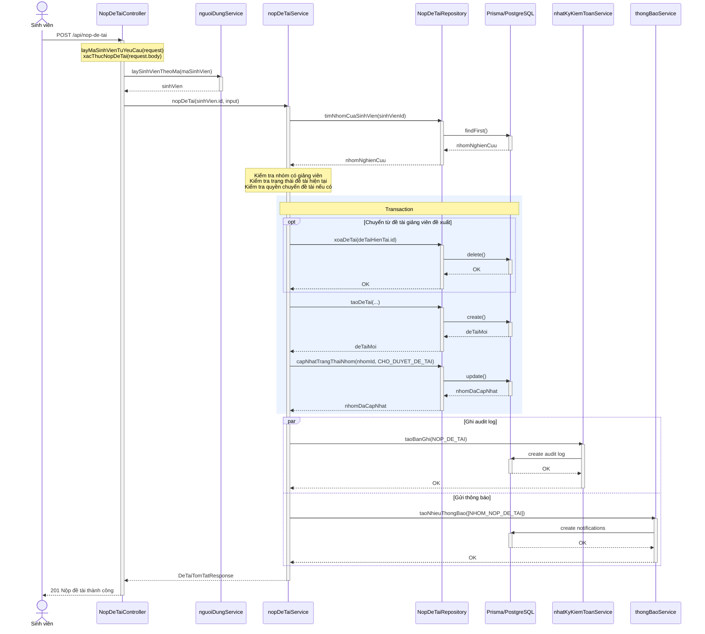
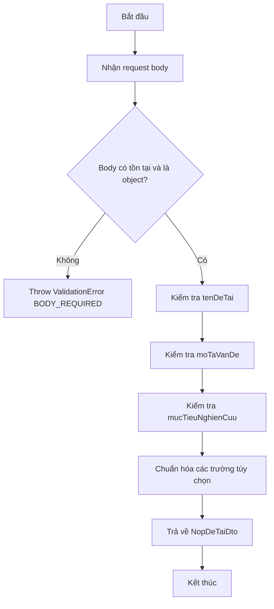
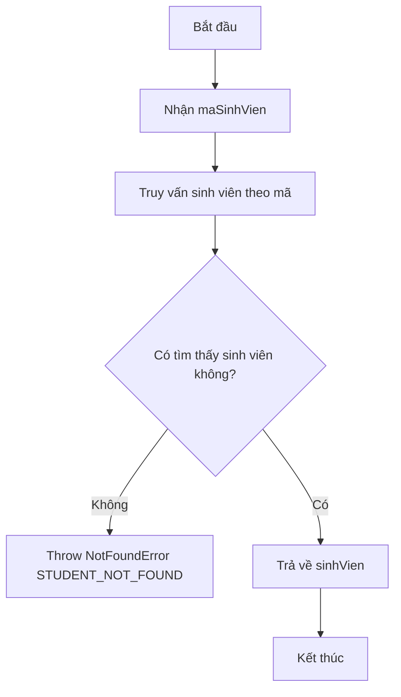
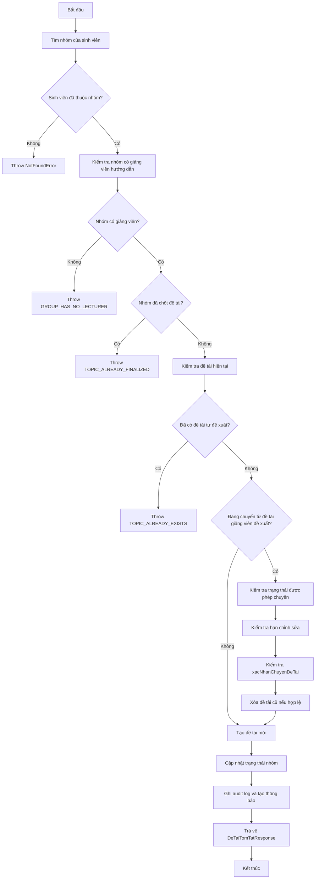
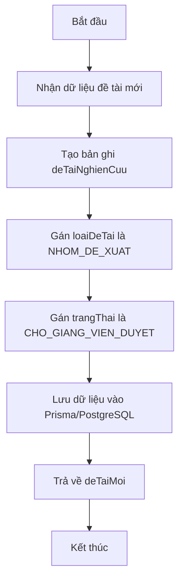
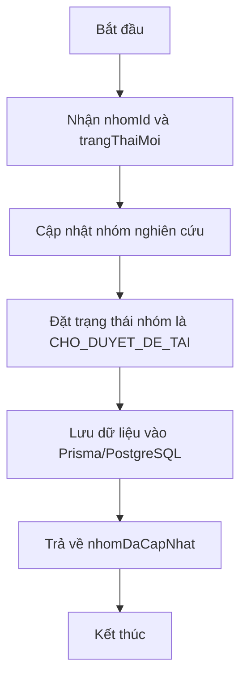

# 4.3.2. Chức năng "Sinh viên nộp đề tài tự đề xuất"

- **Input:** maSinhVien, tenDeTai, moTaVanDe, mucTieuNghienCuu, ungDungThucTien, phamViNghienCuu, congNgheSuDung, lyDoLuaChon, xacNhanChuyenDeTai
- **Output:** Thông báo "Nộp đề tài thành công" hoặc thông báo lỗi tương ứng
- **Process:**
  + Vào màn hình "Tự đề xuất đề tài".
  + Sinh viên nhập thông tin đề tài và nhấn nút "Gửi giảng viên duyệt".
  + Hệ thống lấy mã sinh viên từ request, kiểm tra dữ liệu đầu vào và đối chiếu thông tin sinh viên trong hệ thống.
  + Hệ thống kiểm tra sinh viên đã thuộc nhóm nghiên cứu hay chưa, nhóm đã có giảng viên hướng dẫn hay chưa và nhóm có còn được phép làm đề tài hay không.
  + Hệ thống kiểm tra nhóm hiện tại đã có đề tài chưa. Nếu chưa có đề tài, hệ thống tạo đề tài mới với loại đề tài `NHOM_DE_XUAT`, cập nhật trạng thái nhóm sang `CHO_DUYET_DE_TAI`, ghi nhật ký kiểm toán và tạo thông báo cho giảng viên.
    - Nếu sinh viên chưa thuộc nhóm, hệ thống hiển thị thông báo lỗi tương ứng.
    - Nếu nhóm chưa có giảng viên hướng dẫn, hệ thống hiển thị thông báo `GROUP_HAS_NO_LECTURER`.
    - Nếu nhóm đã chốt đề tài, hệ thống hiển thị thông báo `TOPIC_ALREADY_FINALIZED`.
    - Nếu nhóm đã có đề tài tự đề xuất, hệ thống hiển thị thông báo `TOPIC_ALREADY_EXISTS`.
    - Nếu đang chuyển từ đề tài giảng viên đề xuất nhưng chưa xác nhận chuyển, hệ thống hiển thị thông báo `TOPIC_SWITCH_CONFIRMATION_REQUIRED`.
    - Nếu đề tài cũ không còn được phép chuyển hoặc đã hết hạn chỉnh sửa, hệ thống hiển thị thông báo lỗi tương ứng.

## 4.3.2.1. Sơ đồ tuần tự

## 4.3.2.2. Các unit cần cho chức năng "Sinh viên nộp đề tài tự đề xuất"

- **Dữ liệu**

| STT | Tên | Kiểu dữ liệu | Mô tả |
|-----|-----|--------------|-------|
| 1 | maSinhVien | string | Mã sinh viên gửi trong header `x-ma-sinh-vien` |
| 2 | sinhVienId | bigint | Định danh sinh viên trong hệ thống |
| 3 | tenDeTai | string | Tên đề tài tự đề xuất |
| 4 | moTaVanDe | string | Mô tả vấn đề nghiên cứu |
| 5 | mucTieuNghienCuu | string | Mục tiêu nghiên cứu của đề tài |
| 6 | xacNhanChuyenDeTai | boolean | Xác nhận chuyển từ đề tài giảng viên đề xuất sang đề tài tự đề xuất |
| 7 | nhomNghienCuu | NhomNghienCuu | Nhóm nghiên cứu hiện tại của sinh viên |
| 8 | deTaiMoi | DeTaiTomTatResponse | Đề tài mới được tạo |

- **Unit cần thiết**

| STT | Class | Method | Input | Output |
|-----|-------|--------|-------|--------|
| 1 | NopDeTaiController | nopDeTai(request, response) | request, response | 201: Nộp đề tài thành công |
| 2 | nguoiDungService | laySinhVienTheoMa(maSinhVien) | maSinhVien | sinhVien |
| 3 | nopDeTaiService | nopDeTai(sinhVienId, input) | sinhVienId, input | DeTaiTomTatResponse |
| 4 | NopDeTaiRepository | timNhomCuaSinhVien(sinhVienId) | sinhVienId | nhomNghienCuu |
| 5 | NopDeTaiRepository | xoaDeTai(deTaiId) | deTaiId | OK |
| 6 | NopDeTaiRepository | taoDeTai(input) | input | deTaiMoi |
| 7 | NopDeTaiRepository | capNhatTrangThaiNhom(nhomId, trangThaiMoi) | nhomId, trangThaiMoi | nhomDaCapNhat |
| 8 | nhatKyKiemToanService | taoBanGhi(input) | input | Ghi audit log thành công |
| 9 | thongBaoService | taoNhieuThongBao(danhSachThongBao) | danhSachThongBao | Tạo thông báo thành công |

- `NopDeTaiController::nopDeTai(request, response)`
- `nguoiDungService::laySinhVienTheoMa(maSinhVien)`
- `nopDeTaiService::nopDeTai(sinhVienId, input)`
- `NopDeTaiRepository::timNhomCuaSinhVien(sinhVienId)`
- `NopDeTaiRepository::xoaDeTai(deTaiId)`
- `NopDeTaiRepository::taoDeTai(input)`
- `NopDeTaiRepository::capNhatTrangThaiNhom(nhomId, trangThaiMoi)`
- `nhatKyKiemToanService::taoBanGhi(input)`
- `thongBaoService::taoNhieuThongBao(danhSachThongBao)`

## 4.3.2.3. Activity cho `xacThucNopDeTai()`

## 4.3.2.4. Activity cho `nguoiDungService::laySinhVienTheoMa(maSinhVien)`

## 4.3.2.5. Activity cho `nopDeTaiService::nopDeTai(sinhVienId, input)`

## 4.3.2.6. Activity cho `NopDeTaiRepository::taoDeTai(input)`

## 4.3.2.7. Activity cho `NopDeTaiRepository::capNhatTrangThaiNhom(nhomId, trangThaiMoi)`

## 4.3.2.8. Ghi chú đối chiếu mã nguồn

- Route chính: `backend/src/modules/nop-de-tai/index.ts`
- Controller chính: `backend/src/modules/nop-de-tai/controllers/nop-de-tai.controller.ts`
- Service chính: `backend/src/modules/nop-de-tai/services/nop-de-tai.service.ts`
- Repository chính: `backend/src/modules/nop-de-tai/repositories/nop-de-tai.repository.ts`
- Validator: `backend/src/modules/nop-de-tai/validators/nop-de-tai.validator.ts`
- DTO: `backend/src/modules/nop-de-tai/dto/nop-de-tai.dto.ts`
- Dịch vụ tra cứu sinh viên: `backend/src/modules/nguoi-dung/services/nguoi-dung.service.ts`
- Audit log service: `backend/src/modules/nhat-ky-kiem-toan/services/nhat-ky-kiem-toan.service.ts`
- Notification service: `backend/src/modules/thong-bao/services/thong-bao.service.ts`
